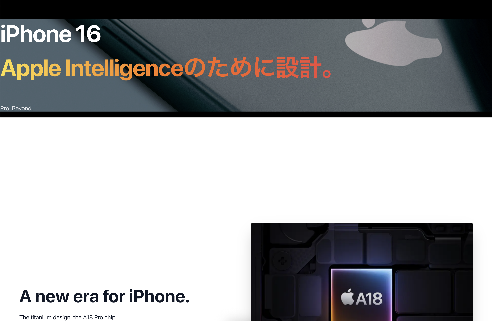

## 概要 (Overview)

このプロジェクトは、Apple社の製品紹介ページにインスパイアされた、スクロール連動アニメーションを多用したランディングページ（LP）です。
モダンなフロントエンド技術である Next.js, TypeScript, Framer Motion を用いて、リッチでインタラクティブなユーザー体験の実現を目指しました。

**デモサイトURL:** [https://apple-style-lp.vercel.app/](https://apple-style-lp.vercel.app/)

## 主な特徴・実装した機能 (Features)

-   **スクロール連動アニメーション:**
    -   ユーザーのスクロール位置に応じて、要素が拡大・縮小したり、フェードイン・アウトします。
    -   `Framer Motion` の `useScroll` および `useTransform` フックを利用して実装。
-   **表示連動アニメーション:**
    -   要素が画面内に入ったことを検知し、フワッと表示されるアニメーションを実装。
    -   `Framer Motion` の `useInView` フックを利用して実装。
-   **レスポンシブデザイン:**
    -   CSS Modules とメディアクエリを使用し、PC、タブレット、スマートフォンなど、あらゆるデバイスで最適なレイアウトが表示されるように設計しました。
-   **グラデーションテキスト:**
    -   CSSの `background-clip: text` を利用して、テキストに美しいグラデーションを適用。
-   **コンポーネントベース設計:**
    -   アニメーションロジックを再利用可能な `AnimateOnScroll` コンポーネントとして切り出し、保守性の高いコードを意識しました。

## 使用技術 (Tech Stack)

-   **フレームワーク:** Next.js (App Router)
-   **言語:** TypeScript
-   **スタイリング:** CSS Modules
-   **アニメーション:** Framer Motion
-   **ホスティング:** Vercel

## 環境構築 (Setup)

1.  リポジトリをクローンします。
    ```bash
    git clone https://github.com/rrencanno/apple-style-lp.git
    ```
2.  プロジェクトディレクトリに移動し、依存パッケージをインストールします。
    ```bash
    cd apple-style-lp
    npm install
    ```
3.  開発サーバーを起動します。
    ```bash
    npm run dev
    ```
4.  ブラウザで [http://localhost:3000](http://localhost:3000) を開きます。

---
